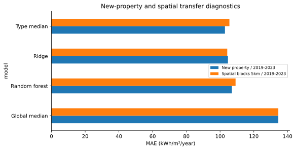

# Calgary Building Energy Benchmarking

[فارسی](README.fa.md) · [Notebook](notebooks/analysis.en.ipynb) · [Methods](docs/methods.md) · [Results](reports/RESULTS.md)

How well do basic building characteristics predict annual energy use when the property, location or reporting year changes?

This repository evaluates that question using public **BenchmarkYYC** disclosures. It compares Ridge regression and Random Forest with building-use medians and, where a consumption history is available, the previous year's energy intensity. Evaluation separates unseen properties, held-out areas within Calgary and later reporting years.

## Data and scope

The reference snapshot contains **2,781 property-year records for 654 property identifiers**, covering **2019–2025**. It was retrieved on **24 September 2026**. One record has no Site EUI; 2,780 records enter the analysis. A property identifier may cover multiple buildings.

Data source: [City of Calgary — BenchmarkYYC](https://www.calgary.ca/environment/programs/building-energy-benchmarking-program.html), through the [public Building Performance Map](https://grid.opentech.eco/orgs/calgary/viz) operated by OPEN Technologies. Reporting year **2025 is provisional** in this release. Public disclosures are a selected sample, not a census of Calgary's buildings.

The repository includes analysis code, aggregate results, figures and a source manifest. Record-level downloads remain local and are excluded from version control. See [data sources and attribution](docs/data-sources.md) for units, retrieval details and reuse boundaries.

## Main findings

The models do not consistently improve on the property-type median. In the 2024 test, Random Forest reduces RMSE slightly but has higher MAE. For properties with a preceding-year observation, persistence is substantially more accurate than the models based on basic characteristics.

| Evaluation | Type median MAE | Ridge MAE | Random Forest MAE |
|---|---:|---:|---:|
| Unseen property, 2019–2023 | 102.89 | 104.67 | 107.02 |
| Spatial blocks, 2019–2023 | 105.54 | 104.25 | 109.19 |
| Later year: 2024, 559 properties | 85.77 | 87.13 | 89.71 |

MAE is measured in **kWh/m²/year**; lower is better. On the same 547 properties with a 2023 observation, persistence MAE is **32.40**, versus **84.23** for the type median and **88.96** for Random Forest. These results describe the fixed models and snapshot evaluated here; they are not an exhaustive comparison of learning algorithms.



## Run the analysis

Use Python **3.12**. From the repository root, create a virtual environment and install the recorded requirements:

```bash
python -m venv .venv
# Windows PowerShell: .venv\Scripts\Activate.ps1
# macOS / Linux: source .venv/bin/activate
python -m pip install -r requirements.txt
python scripts/download_data.py --output data/snapshots/2026-09-24-release
python scripts/run_notebook.py notebooks/analysis.en.ipynb
```

The downloader refuses to overwrite an existing snapshot. For a later retrieval, choose a new directory and set `BENCHMARKYYC_SNAPSHOT` to its absolute path before running the notebook. Set `BENCHMARKYYC_RESULTS` to choose a separate output directory. By default, outputs are written to `results/local/`.

For interactive work, install JupyterLab with `python -m pip install jupyterlab`, then open either [the English notebook](notebooks/analysis.en.ipynb) or [the Persian notebook](notebooks/analysis.fa.ipynb). Both editions contain identical analysis code.

Upstream records can be revised. A new download may therefore produce different results even when the reporting years are unchanged. Compare its provenance hashes with [`data/reference_manifest.json`](data/reference_manifest.json). The source does not provide an immutable archive through this endpoint, so exact reconstruction requires retaining the original local snapshot.

## Research design

- **Target:** annual Site EUI.
- **Predictors:** property type, log floor area, construction year and reporting year.
- **Controls against leakage:** transformations fitted within training sets; no same-year energy, emissions, water or ENERGY STAR inputs; property-disjoint grouped and spatial folds.
- **Interpretation:** Exact SHAP on 100 held-out 2024 properties, with a training-only background. Attributions explain the fitted model; they do not estimate retrofit effects.

Historical records may have been revised after their reporting dates. Spatial blocks have no boundary buffer. Participation is selective, and occupancy, weather, building envelope and HVAC details are unavailable. The study does not support causal savings claims or generalization beyond the disclosed Calgary sample. [Methods and limitations](docs/methods.md) describe these boundaries in detail.

## Project layout

```text
notebooks/          English and Persian analysis notebooks
src/benchmarkyyc/   Source parsing and evaluation splits
scripts/            Data retrieval, execution and notebook checks
tests/              Unit, identity and split-boundary tests
data/               Reference manifest and field dictionary
reports/            Aggregate results and figures
docs/               Methods, source attribution and contribution notes
```

## Checks

```bash
# Windows PowerShell: $env:PYTHONPATH="src"
# macOS / Linux: export PYTHONPATH=src
python -m unittest discover -s tests -v
python scripts/check_notebooks.py
```

The automated checks use synthetic fixtures and do not download live data. They test source parsing, unit changes, conflicting identities and train/test boundaries. The complete analysis is a separate run against a dated public snapshot.

## Citation and license

Use [`CITATION.cff`](CITATION.cff) to cite the software and cite the City of Calgary as the data provider. Authored code and documentation are released under the [MIT License](LICENSE). That license does not apply to third-party source data or grant rights over City of Calgary or OPEN Technologies material. This is an independent research repository and is not an official City product.
