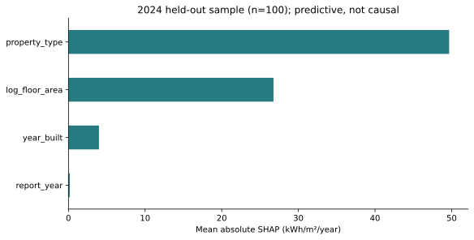

# Results from the reference snapshot

[فارسی](RESULTS.fa.md) · [Methods](../docs/methods.md)

Snapshot date: **24 September 2026**. These results use fixed model settings and the data identified in [`reference_manifest.json`](../data/reference_manifest.json). They are exploratory research results, not a peer-reviewed performance claim.

## Main comparison

| Scenario | Method | MAE | RMSE | R² |
|---|---|---:|---:|---:|
| Unseen property, 2019–2023 | Type median | 102.89 | 185.06 | 0.462 |
| Unseen property, 2019–2023 | Ridge | 104.67 | 181.43 | 0.483 |
| Unseen property, 2019–2023 | Random Forest | 107.02 | 188.60 | 0.441 |
| Spatial blocks, 2019–2023 | Type median | 105.54 | 187.94 | 0.445 |
| Spatial blocks, 2019–2023 | Ridge | 104.25 | 179.91 | 0.491 |
| Spatial blocks, 2019–2023 | Random Forest | 109.19 | 188.83 | 0.440 |
| 2024, trained through 2023 | Type median | 85.77 | 187.78 | 0.380 |
| 2024, trained through 2023 | Ridge | 87.13 | 186.72 | 0.387 |
| 2024, trained through 2023 | Random Forest | 89.71 | 182.25 | 0.416 |

MAE and RMSE are in kWh/m²/year. Grouped and spatial evaluations contain 1,754 out-of-fold property-year predictions per method. The 2024 test contains 559 properties.

Random Forest has higher MAE than the type median in all three principal scenarios. In 2024 it has slightly lower RMSE, illustrating that the error criterion affects the comparison. Ridge has the lowest spatial MAE among the three reported methods, with a modest margin.

The paired 2024 MAE difference, Random Forest minus type median, is **+3.94**. A conditional paired bootstrap gives a 95% interval of **−2.30 to +10.18**. The interval spans zero and does not establish a reliable advantage for either method. It excludes uncertainty from model refitting and source selection.

## Properties with consumption history

The following methods are evaluated on the **same 547 properties** with a 2023 observation:

| Method | 2024 MAE | 2024 RMSE | 2024 R² |
|---|---:|---:|---:|
| Previous-year EUI | 32.40 | 59.86 | 0.938 |
| Type median | 84.23 | 187.85 | 0.390 |
| Ridge | 85.91 | 186.95 | 0.396 |
| Random Forest | 88.96 | 183.01 | 0.421 |

Consumption history is a strong baseline in this subset. These numbers do not show how persistence would perform for a property without a preceding-year observation. Only 11 properties in the full 2024 test have never appeared in training; subgroup results should be interpreted cautiously.

## Interpretation

In the 100-property held-out SHAP sample, property type and floor area contribute more to the fitted model's predictions than construction year or reporting year. This is a model-specific attribution, not a finding that changes in those attributes cause a particular energy saving. The sample, background and model settings affect the ranking.

## Figures and numerical outputs

1. [Coverage and missingness](figures/01_coverage.svg)
2. [All-property and common-cohort trends](figures/02_cohort_trend.svg)
3. [2024 distributions within building uses](figures/03_property_types_2024.svg)
4. [Grouped and spatial validation](figures/04_group_spatial_validation.svg)
5. [Temporal validation](figures/05_temporal_validation.svg)
6. [2024 residual diagnostics](figures/06_2024_residuals.svg)
7. [Held-out SHAP summary](figures/07_shap_2024.svg)

Aggregate CSV tables are in [`tables/`](tables/). Prediction-level outputs are generated locally. The figures expose sample variation rather than classifying high-use properties as inefficient. Extreme residuals require contextual investigation.

## Implications for further research

Basic characteristics support a useful baseline, but the fixed learning models do not consistently improve typical absolute error. Operating schedules, occupancy, weather, system characteristics and retrofit histories may be more informative than additional model complexity. Assess those additions with nested training validation, buffered spatial tests and a fresh external evaluation set.
